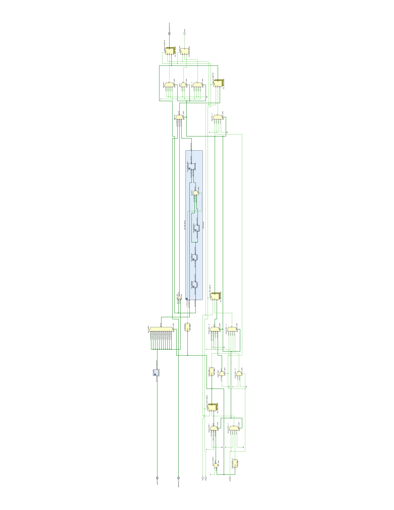

# AES-128-VHDL-Accelerator
# AES-128-VHDL-Accelerator

A cycle-accurate, hardware-optimized AES-128 encryption core implemented in VHDL with a 12-clock-cycle latency. 

This project provides a fully structural, modular implementation of the Advanced Encryption Standard (AES) algorithm for 128-bit keys. It is designed for high throughput and easy integration into larger digital systems, with individual cryptographic modules structurally verified.

## Project Structure

The repository is organized into source code and testbenches:

*   **`src/`**: Contains the synthesizable VHDL design files.
    *   `AES_Top.vhd` - The top-level entity wrapping the encryption logic and control state machine.
    *   `AES_Round.vhd` - Instantiates the iterative transformations for standard and final rounds.
    *   `KeyExpansion.vhd` - Generates the round keys on-the-fly or stores them (based on implementation).
    *   `AddRoundKey.vhd`, `SubBytes.vhd`, `ShiftRows.vhd`, `MixColumns.vhd` - The core AES transformation modules.
*   **`tb/`**: Contains the VHDL testbenches used for simulation and verification.
    *   `tb_AES_Top.vhd` - Top-level simulation checking plaintext/ciphertext pairs.
    *   `tb_KeyExpansion.vhd`, `tb_MixColumns.vhd`, `tb_SubBytes.vhd` - Unit tests for individual modules.
*   **`docs/`**: Documentation and architectural diagrams (including the RTL schematic).

## Architecture & Schematic

The design utilizes a finite state machine (FSM) to control the data path, managing the initial round, the 10 standard processing rounds, and the final round. 

You can view the full detailed RTL schematic in the [`docs/schematic.pdf`](docs/schematic.pdf).

## Simulation and Synthesis

This core was compiled and verified using Vivado. 

**To run the simulation:**
1. Create a new RTL project in your IDE.
2. Add all `.vhd` files from the `src/` directory as design sources.
3. Add the `.vhd` files from the `tb/` directory as simulation sources.
4. Set `tb_AES_Top` as the top module for simulation and run the behavioral simulation.

## Performance & Utilization
*(Placeholder: Update this section once you run synthesis)*
*   **Target Device:** [e.g., Xilinx Artix-7]
*   **LUTs:** [Number]
*   **Registers:** [Number]
*   **Maximum Clock Frequency (Fmax):** [Number] MHz
*   **Latency:** 12 Clock Cycles
